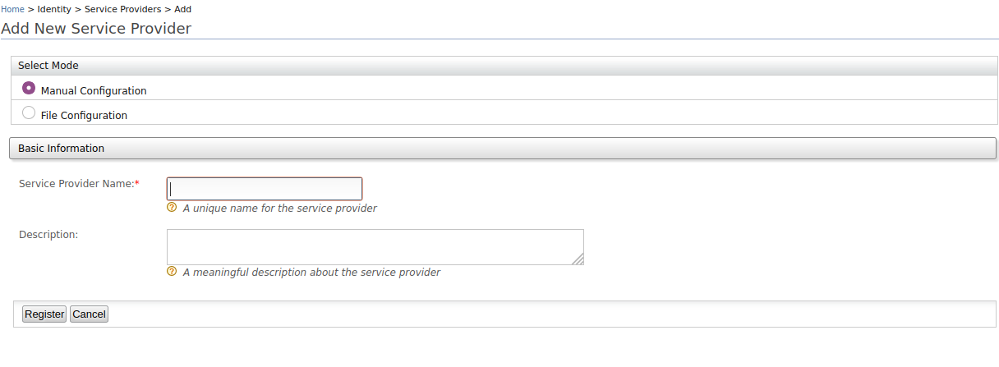

# identity-local-auth-magiclink
Magic link authenticator for WSO2 Identity Server

Download the source code from [here](https://github.com/wso2-extensions/identity-local-auth-magiclink)

Navigate to the folder you just downloaded, which contains the pom.xml file and build the source code by running the following command on your terminal.

    $ mvn clean install

# Configuring Magic Link Authenticator
This section provides the instructions to configure Magic Link Authenticator in WSO2 Identity Server (WSO2 IS). The Magic Link Authentication is a password-less authentication implemented by sending an embedded token via a link in email. 

Let's take a look at the tasks you need to follow to configure Magic Link Authenticator:

- [Enabling configurations on WSO2 IS](#enabling-configurations-on-WSO2-IS)
- [Configure the Service Provider](#configure-the-service-provider)
- [Deploy the sample web application](#deploy-the-sample-web-application)
- [Create a user and update the email address of the user](#create-a-user-and-update-the-email-address-of-the-user)
 
**Before you begin!**
To ensure you get the full understanding of configuring Magic Link Authenticator with WSO2 IS, the sample pickup-dispatch application is used in this use case. The samples run on the Apache Tomcat server and are written based on Servlet 3.0. Therefore, download Tomcat 8.x from here. Install Apache Maven to build the samples.

### Enabling configurations on WSO2 IS

Follow the steps below to configure WSO2 IS to send email once the Magic Link Authenticator is enabled.

1. Shut down the server if it is running.

2. Add the following properties to the deployment.toml file in the IS_HOME/repository/conf folder to configure the email server.
      
            [output_adapter.email]
            from_address= "<sample-email@zohomail.com>"
            username= "<sample-email@zohomail.com>"
            password= "<password>"
            hostname= "smtp.zoho.com"
            port= 587
            enable_start_tls= true
            enable_authentication= true
 
3. Start WSO2 IS

### Configure the Service Provider

Follow the steps below add a service provider:

1. Return to the Management Console home screen.

2. Click Add under Add under Main > Identity > Service Providers.

   

3. Enter pickup-dispatch as the Service Provider Name.

   
  
4. Click Register.

5. Expand OAuth/OpenID connect Configuration under Inbound Authentication Configuration.

6. Enter the following value as the Callback URL: http://localhost.com:8080/pickup-dispatch/oauth2client.

   

7. Click Add. Note the OAuth Client Key and Client Secret that is displayed. You will need these values later on when deploying the sample application.

8. Click Register to save the changes.

9. Go to the Local and Outbound Authentication Configuration section and select the Advanced configuration radio button option.

      1. Creating the first authentication step:
      
          - Click Add Authentication Step.
       
          - Click Add Authenticator that is under Local Authenticators of Step 1 to add the identity-first handler as the first step.
      
     2. Creating the second authentication step:

         - Click Add Authentication Step.

         - Click Add Authenticator that is under Local Authenticators of Step 2 to add the MagicLink   
         
    

10. Click Update.
 
### Deploy the sample web application

1. Use the Apache Tomcat server to do this. If you have not downloaded Apache Tomcat already, [download](https://tomcat.apache.org/download-80.cgi) it from here.

2. Copy the .war file into the webapps folder. For example, <TOMCAT_HOME>/apache-tomcat-/webapps .

3. Download the pickup-dispatch.war file from the latest release assets. Refer this [document](https://is.docs.wso2.com/en/5.9.0/learn/deploying-the-sample-app/#deploying-the-pickup-dispatch-webapp) to add further configurations. 

4. Start the Tomcat server.

Hint: To check the sample application, navigate to http://<TOMCAT_HOST>:<TOMCAT_PORT>/pickup-dispatch/oauth2client on your browser.
For example,  http://localhost.com:8080/pickup-dispatch/oauth2client
Note: It is recommended that you use a hostname that is not localhost to avoid browser errors. Modify the /etc/hosts entry in your machine to reflect this. Note that localhost is used throughout this documentation as an example, but you must modify this when configuring these authenticators or connectors with this sample application.

###  Create a user and update the email address of the user

Follow the steps given below to update the user's email address.

1. Return to the WSO2 Identity Server Management Console home screen.

   

2. Click Add

3. Click Add New User. 

   

4. The Add User page opens. Provide the username and password and click Finish. 

   

5. Click the User Profile. 

   

6. Click the User Profile and provide First Name and Email. 

   

7. Click Update.

# Try it out

1. Go to http://<TOMCAT_HOST>:<TOMCAT_PORT>/pickup-dispatch/oauth2client (http://localhost.com:8080/pickup-dispatch/oauth2client) on your browser.

2. Click Login.

3. Enter the username of the newly created user.

4. You will receive an email to the user’s email address added previously.

5. Click the button in email and you will be redirected to the pickup-dispatch app logged in.

   

